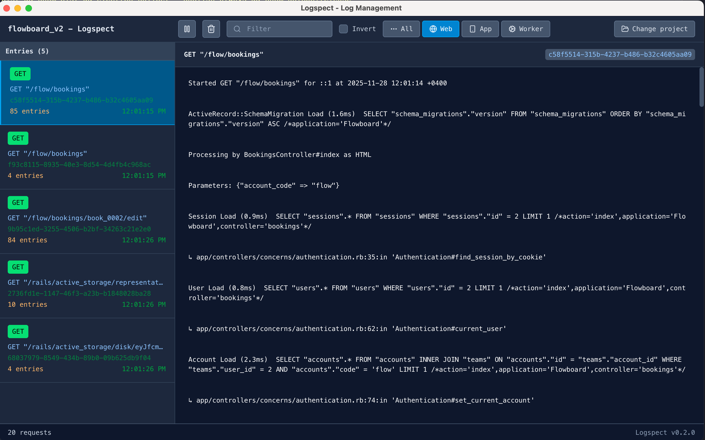

# Logspect - Ruby on Rails Log Viewer

A powerful Electron-based log viewer application for Ruby on Rails projects. It aims to become the dev tool for log related debugging and unlock productivity.



## Features

- Modern Vue.js frontend with Vite for fast development
- Beautiful, responsive UI for log viewing and management
- Real-time log filtering and searching by request ID
- Rails log parsing and grouping by request
- Multiple HTTP method support (GET, POST, PUT, DELETE, PATCH)
- Cross-platform Electron application

## How to use

- Download the latest release from the [releases page](https://github.com/Cr1stal/Logspect/releases)
- Add `config.log_tags = [ :request_id ]` to your Rails application's `config/application.rb` file
- Restart your Rails application
- Open Logspect and select your Rails application directory
- Start your Rails application
- Open Logspect and start viewing logs

## Development

### Prerequisites

- Node.js (v20 or higher recommended)
- pnpm package manager
- overmind (brew install overmind)

### Getting Started

#### Option 1: Integrated Development (Recommended)

Run Electron Forge, which starts the Vite renderer for you:

```bash
pnpm install
pnpm start
```

This will:

1. Bundle the Electron main and preload processes with Forge
2. Start the Vite renderer at `http://localhost:5173`
3. Launch Electron against that renderer
4. Keep the whole app in a single dev loop

`overmind start` still works, but it now just wraps the same integrated `pnpm start` flow.

#### Option 2: Renderer-only Development

If you only want to work on the Vue UI in a browser:

1. Install dependencies:

   ```bash
   pnpm install
   ```

2. Start the Vue.js development server:

   ```bash
   pnpm dev
   ```

### Building

- Build the Vue.js renderer bundle:

  ```bash
  pnpm build
  ```

- Create Electron Forge distributables:

  ```bash
  pnpm dist
  ```

- Create unsigned macOS release artifacts locally:

  ```bash
  pnpm dist:mac
  ```

### Available Scripts

- `pnpm start` - Start Electron Forge in development mode
- `pnpm dev` - Start the renderer Vite server only
- `pnpm build` - Build the renderer bundle
- `pnpm package` - Package the Electron app without making distributables
- `pnpm dist` - Make Electron Forge distributables
- `pnpm dist:mac` - Build unsigned macOS release artifacts (`.dmg` and `.zip`)
- `pnpm release` - Publish the macOS release through GitHub via Electron Forge

## GitHub Releases

GitHub Actions can publish an unsigned macOS release through Electron Forge.

How it works:

- Push a tag like `v0.5.0`, or run the `Release macOS build` workflow manually from `main`.
- Manual workflow runs use the selected `main` commit directly, so the release tag does not need to exist before the run starts.
- The tag must match the version in `package.json`.
- Electron Forge makes the `.dmg` and `.zip` artifacts and publishes them to GitHub Releases.
- No Apple Developer membership is required.

Electron Forge's Vite plugin is currently documented by Forge as experimental, so future Forge minor upgrades may require small config updates.

Because the app is unsigned, macOS Gatekeeper may warn users on first launch. In practice, users may need to right-click the app and choose `Open`, or allow it in `System Settings -> Privacy & Security`.

Automatic in-app updates are disabled for these unsigned Forge builds. The app opens the GitHub releases page for manual downloads instead.

## Project Structure

- `src/` - Electron main process files
  - `main.js` - Main Electron process with Rails log parsing
- `src-vue/` - Vue.js frontend source code
  - `components/` - Vue components
  - `assets/` - Static assets
  - `App.vue` - Main Vue application
  - `main.js` - Vue application entry point
  - `index.html` - Development HTML template
- `out/` - Electron Forge packaging and make artifacts (generated)
- `vite.renderer.config.mjs` - Renderer Vite configuration used by Forge
- `vite.main.config.mjs` / `vite.preload.config.mjs` - Vite configs for Electron main and preload bundles
- `src/preload.js` - Electron preload script for secure IPC

## How It Works

1. **Development Mode**: Electron Forge starts Vite and loads the renderer from `http://localhost:5173`
2. **Production Mode**: Electron Forge packages the bundled main, preload, and renderer assets together
3. **Rails Integration**: Select a Rails project directory to monitor `log/development.log`
4. **Real-time Updates**: Log entries are parsed and grouped by request ID, then streamed to the Vue frontend

## Tech Stack

- **Frontend**: Vue.js 3, Vite
- **Desktop**: Electron
- **Package Manager**: pnpm
- **Build Tool**: Electron Forge + Vite

## License

This project is licensed under the MIT License - see the [LICENSE](LICENSE) file for details.
